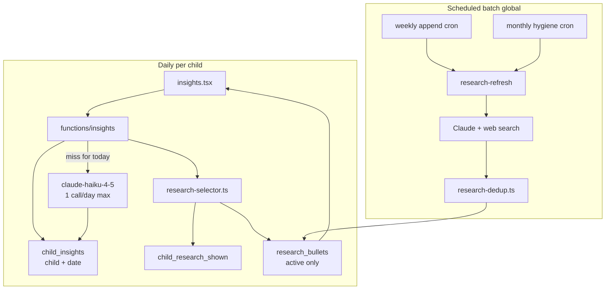
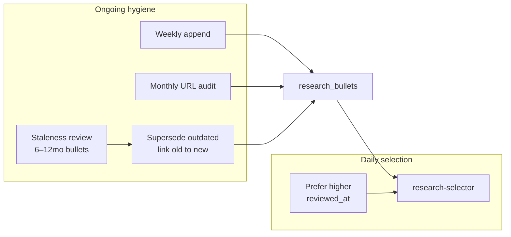

# Insights Tab — Daily AI Observations + Research Bank with Daily Rotation

## Goals

- New **Insights** tab with two sections:
  1. **Observations** — AI-generated short bullets + longer pattern narrative, strictly grounded in logged data
  2. **Research** — a daily handful of dot-point research insights (with source links), drawn from a **large pre-generated bank**
- **Research bank must be deep enough** that each child sees a fresh, relevant selection daily — **at least 1 bullet never shown to them before**, every day
- **Bank stays fresh and non-redundant** as it grows — stale bullets are reviewed and superseded; new bullets are deduplicated before insert
- **Cost-efficient**:
  - Observations: **1 Haiku call per child per calendar day** maximum
  - Research on tab visit: **0 LLM calls** — selection only from stored bank

---

## Architecture



---

## Observations — daily AI cache

- Keyed by `(child_id, insight_date)` — **1 Haiku call per child per calendar day** max
- No deterministic UI stats; `insight-stats.ts` is LLM input only
- Output includes `categories[]` for research matching

```json
{
  "shortInsights": ["2–4 concise bullets"],
  "longInsights": ["1–2 paragraphs"],
  "categories": ["sleep", "feeding", "development"]
}
```

### Intraday stability guarantee

What a user sees on the Insights tab **must not change** for the rest of that calendar day, for the same child and region — even if they log more data, pull to refresh, or revisit the tab.

**Cache key**: `(child_id, insight_date)` for observations + `selected_research_by_region[userRegion]` for research.

| Action | Same-day behaviour |
|--------|-------------------|
| Reopen Insights tab | Return cached payload — 0 LLM calls |
| Pull-to-refresh | Re-fetch from server; server returns same cached row — **no regeneration** |
| `useFocusEffect` on tab focus | Same as above — read-only refresh |
| Log new events after first visit | Observations **do not update** until next calendar day (by design) |
| Second caregiver, same region | Same cached research + observations |
| Switch active child | Different cache row — expected |

**Server rules** (`insights` edge function):

1. If `child_insights` row exists for `(childId, currentDate)` with non-null `short_insights` → **never call Haiku again** that day
2. If `selected_research_by_region[userRegion]` is already set → **never re-run selector** that day
3. Upsert uses **merge-only** for region keys — never overwrite an existing region's bullet IDs once written
4. **Concurrent first visits** (two devices at once): rely on PK `(child_id, insight_date)` + generation guard — only the first successful write wins; the second request detects existing row and returns it without regenerating (no `force` parameter exposed)

**Client rules** (`use-insights.ts`):

- No `forceRegenerate` flag in v1
- Pass stable `currentDate` (local calendar date from device, same as chat)
- Pass stable `userRegion` per session — avoid mid-day locale flicker by reading once on mount and caching in hook state
- Display `generatedAt` from server so user understands insights reflect data as of first visit

**Intentional tradeoff**: insights reflect the child's data **as of the first Insights visit that day**, not live-updating as logs come in. This is what makes the 1-call/day limit and intraday stability possible.

**Edge case — region change**: if `userRegion` changes mid-day (rare — e.g. locale change), user may see a different research set for the new region key; observations stay the same. Regions are cached independently so each region is itself stable intraday.

---

## Research bank — scale and depth

### Target bank size

| Phase | Bullets per pack | Total bullets |
|-------|------------------|---------------|
| **Initial bootstrap** | ~25 per pack | **~1,050** (42 packs) |
| **Weekly append** | up to +5 per pack | **up to +210/month** (less if dedup rejects) |

### Age brackets (0–36 months) — 7 brackets

| Bracket | Months |
|---------|--------|
| newborn | 0–2 |
| infant_early | 3–5 |
| infant | 6–8 |
| infant_late | 9–11 |
| toddler_early | 12–17 |
| toddler | 18–23 |
| toddler_late | 24–36 |

### Categories — 6 per bracket

`sleep`, `feeding`, `development`, `milestones`, `regression`, `language`

**42 packs** total (7 × 6). Each pack researched across multiple **subtopics** for diversity.

---

## Research sources and authority standards

Research bullets are **never written from model memory alone**. Every bullet is produced during batch generation (`research-refresh`) using **Claude + web search**, and must cite a page found in that search. The tab itself only recalls stored bullets — it does not generate or look up sources at runtime.

Shared policy module: [`supabase/functions/_shared/research-source-policy.ts`](supabase/functions/_shared/research-source-policy.ts)

Contains: domain allowlist, blocked patterns, URL validator, category-specific search hints, and the cached static prompt block injected into every research generation call.

### Approved source tiers

**Tier 1 — Government health agencies (preferred)**

| Organisation | Example domains | Typical use |
|--------------|-----------------|-------------|
| CDC | `cdc.gov` | Milestones, sleep safety, development screens |
| NHS | `nhs.uk` | Practical UK guidance on sleep, feeding, behaviour |
| WHO | `who.int` | Growth standards, early development |
| NIH / NICHD | `nichd.nih.gov`, `medlineplus.gov` | Evidence-based child health |
| Australian Dept of Health | `health.gov.au`, `raisingchildren.net.au` | Development and parenting guidance (AU) |
| Health Canada | `canada.ca` (child health sections) | Canadian guidance (CA) |

**Tier 2 — Professional medical / early-childhood bodies**

| Organisation | Example domains | Typical use |
|--------------|-----------------|-------------|
| AAP (Healthy Children) | `healthychildren.org` | Sleep, feeding, developmental expectations |
| RCPCH | `rcpch.ac.uk` | UK paediatric standards |
| Caring for Kids (CPS) | `caringforkids.cps.ca` | Canadian paediatric guidance |
| Zero to Three | `zerotothree.org` | Early brain development, social-emotional |
| UNICEF | `unicef.org` | Early childhood development |

**Tier 3a — Institutional (when Tier 1–2 lack coverage)**

| Organisation | Example domains | Constraint |
|--------------|-----------------|------------|
| NHS-affiliated trusts | `*.nhs.uk` subdomains | Must be nhs.uk subdomain |
| Government education portals | `*.gov.uk`, `*.gov.au` | Child development content only |

**Tier 3b — Scientific journals (when Tier 1–2 lack coverage)**

Use peer-reviewed research only when agency guidance does not cover the specific subtopic. Journal bullets add evidence depth (e.g. sleep training efficacy, language acquisition timelines) — not as the default source.

| Source type | Example domains / patterns | Constraint |
|-------------|---------------------------|------------|
| PubMed Central (open access) | `pmc.ncbi.nlm.nih.gov`, `ncbi.nlm.nih.gov/pmc/articles/` | Full text must be freely readable — no abstract-only pages |
| Cochrane Library | `cochranelibrary.com` | Plain-language or consumer summaries preferred; systematic reviews only |
| Open-access publishers | `journals.plos.org`, `frontiersin.org`, `bmjopen.bmj.com` | Full article or official summary page must be public |
| Publisher open-access pediatrics journals | `pediatrics.aappublications.org` (OA articles only), `onlinelibrary.wiley.com` (OA flagged) | Reject if paywall detected on HEAD/GET |

Journal rules:
- Must be **peer-reviewed** (original research, systematic review, or clinical guideline published in a journal)
- `source_url` must link to **readable content** — full text, PMC article, or official plain-language summary — not a paywalled abstract
- `source_name` = journal name (e.g. "Pediatrics", "Cochrane", "PLOS ONE")
- `text` must translate findings into parent-friendly language; cite the study's conclusion, not raw statistics
- Cap journal-sourced bullets at **~20% of any pack** (~5 of 25) — agency guidance remains the majority

**Source priority**: Tier 1 → Tier 2 → Tier 3a → Tier 3b → **regional tiebreak** (see below). Use journals only after searching Tier 1–2 without an acceptable result for that subtopic.

### Regional source preference

When multiple sources are equally valid at the same tier, **prefer publishers closer to the user's region**. Regional preference is a **tiebreak only** — it never overrides tier priority (NHS does not beat CDC if CDC is the only Tier 1 result for a subtopic).

**Region detection** (client → edge function):
- Use `expo-localization` device region (`Localization.getLocales()[0].regionCode`) → ISO country code (e.g. `GB`, `US`, `AU`)
- Passed as `userRegion` on every `insights` invoke alongside `currentDate`
- Fallback: `GLOBAL` if region unknown or unmapped

**Region → publisher mapping** in `research-source-policy.ts`:

| User region | Preferred sources (tiebreak order) |
|-------------|-----------------------------------|
| `GB`, `IE` | NHS, RCPCH, `*.nhs.uk`, `*.gov.uk` |
| `US` | CDC, AAP (Healthy Children), NIH/NICHD |
| `AU`, `NZ` | raisingchildren.net.au, health.gov.au |
| `CA` | Caring for Kids (CPS), Health Canada pages on `canada.ca` — add to allowlist |
| `GLOBAL` / other | WHO, UNICEF, then any Tier 1–2 |

Each bullet is tagged at insert with `source_region`: `UK` | `US` | `AU` | `CA` | `GLOBAL` — derived automatically from `source_domain` via `inferSourceRegion(domain)`.

**Bank diversity at generation time** — bootstrap and weekly append prompts include:
*"Where available, include insights from UK (NHS), US (CDC/AAP), and Australian (raisingchildren.net.au) sources so the bank has regional coverage per pack."*

This ensures the selector has regional options to prefer — not just US-centric content.

**Regional tiebreak at selection time** (`research-selector.ts`):

After filtering by novelty, relevance, and age bracket, sort candidates:
1. `source_region` matches user's mapped region (e.g. `GB` → `UK`)
2. `source_region = GLOBAL` (WHO, UNICEF, Cochrane, PMC)
3. Other regions (shown only if no regional/GLOBAL match exists for that category)

**Per-region daily cache**: observations are shared per child per day, but research selection is cached **per region** since caregivers in different countries may view the same child:

- `child_insights.selected_research_by_region` — `jsonb` e.g. `{ "GB": ["uuid", ...], "US": ["uuid", ...] }`
- First visit today from a `GB` device → select + cache GB bullets; first visit from `US` device → separate US-leaning selection
- Still **0 LLM calls** for research — only the DB selection differs

### Blocked sources (never store)

- Parenting blogs, personal websites, Medium/Substack opinion pieces
- Forums and social media (Reddit, Mumsnet threads, Facebook, TikTok)
- Commercial / product marketing sites (formula brands, sleep-training apps, supplement sellers)
- News outlets reporting second-hand — use the primary agency link instead
- Wikipedia, wikis, and AI-generated content farms
- Alternative medicine sites
- Paywalled journal abstracts or DOI landing pages with no free full text
- Preprints (bioRxiv, medRxiv) — not peer-reviewed
- Single-case reports or anecdotal clinic blogs

Enforced server-side: `validateSourceUrl(url)` rejects before insert even if Claude returns a bad link. Journal URLs additionally pass `validateJournalAccess(url)` — HEAD/GET confirms page is not behind a paywall (no login wall, no "buy PDF" as sole content).

### What each bullet must contain

```json
{
  "text": "One parent-friendly sentence stating a single factual insight.",
  "sourceUrl": "https://www.cdc.gov/ncbddd/actearly/milestones/...",
  "sourceName": "CDC",
  "sourceTier": "tier_1",
  "subtopic": "nap_transitions"
}
```

Optional journal example:

```json
{
  "text": "Studies suggest most infants begin consolidating night sleep between 3–6 months, though timing varies widely.",
  "sourceUrl": "https://pmc.ncbi.nlm.nih.gov/articles/PMC...",
  "sourceName": "Pediatrics",
  "sourceTier": "tier_3b",
  "subtopic": "night_sleep_consolidation"
}
```

Rules:
- `text` — paraphrase the source in plain language; do not quote long passages; no medical diagnoses or prescriptive treatment
- `sourceUrl` — deep link to the specific page where possible, not a homepage
- `sourceName` — publisher or journal name matching the allowlist entry
- `sourceTier` — `tier_1` | `tier_2` | `tier_3a` | `tier_3b` — stored on `research_bullets` for audit and pack balance checks
- One bullet = one verifiable claim

### Static prompt block (cached across all research calls)

Stored in `research-source-policy.ts` as `RESEARCH_SYSTEM_INSTRUCTIONS` with `cache_control: ephemeral`:

```
You are researching evidence-based child development guidance for parents.

SOURCE RULES (mandatory):
- Use web search for every bullet. Do not rely on memory alone.
- Prefer sources in this order: government health agencies (CDC, NHS, WHO, NIH),
  professional bodies (AAP, RCPCH, Zero to Three, UNICEF), then institutional
  portals, then peer-reviewed journals — only when higher tiers lack coverage.
- Journal sources (Tier 3b): cite only open-access full text (PubMed Central,
  Cochrane summaries, open-access publisher pages). Never cite paywalled abstracts.
- Each bullet must include the exact URL of the page where you found the fact.
- Do not cite blogs, forums, news articles, commercial sites, Wikipedia, or preprints.
- Do not state medical diagnoses, prescribe treatments, or replace a pediatrician.
- Translate journal findings into plain parent-friendly language.
- Use ranges and "typically" language — children develop at different rates.
- Where available, gather sources from multiple regions (UK, US, Australia) so the bank
  has regional coverage — do not rely on a single country's guidance alone.
- If search finds no acceptable source for a subtopic, omit that bullet rather than guess.

OUTPUT: Return JSON array of bullets. Each bullet is one fact, one source.
```

### Category-specific search guidance

Passed as dynamic context per pack to focus web search:

| Category | Search focus | Example query pattern |
|----------|--------------|----------------------|
| `sleep` | Total sleep needs, nap transitions, safe sleep, regressions | `"infant sleep" {age_label} site:cdc.gov OR site:nhs.uk` |
| `feeding` | Milk intake, solids introduction, appetite, hydration | `"baby feeding" {age_label} site:healthychildren.org OR site:nhs.uk` |
| `development` | Motor, cognitive, social milestones for age | `"child development milestones" {age_months} months site:cdc.gov OR site:who.int` |
| `milestones` | Upcoming achievements, variation vs delay | `"developmental milestones" {age_label} site:cdc.gov` |
| `regression` | Sleep/behaviour regressions, duration, coping | `"sleep regression" {age_label} site:nhs.uk OR site:healthychildren.org` |
| `language` | Babbling, words, comprehension | `"language development" {age_label} site:cdc.gov OR site:nhs.uk` |

Fallback query when agency results are thin (append to dynamic prompt, not primary):

`{subtopic} infant OR child site:pmc.ncbi.nlm.nih.gov OR site:cochranelibrary.com`

`{age_label}` is human-readable (e.g. "12 month old", "18–24 months") derived from the age bracket.

### Server-side URL validation (`validateSourceUrl`)

Applied in `research-dedup.ts` before any bullet is stored:

1. Must be `https://`
2. Domain must match allowlist (exact or approved subdomain / journal pattern)
3. HEAD request returns 2xx or 3xx (follow redirects; reject if redirect leaves allowlist)
4. Reject URL shorteners (`bit.ly`, `t.co`, etc.)
5. **Journal URLs** (`tier_3b`): run `validateJournalAccess()` — page must not be paywalled; reject PubMed abstract-only URLs (`pubmed.ncbi.nlm.nih.gov` without PMC full-text link)
6. Store `source_domain` and `source_tier` on `research_bullets` row for audit queries
7. Reject pack insert if `tier_3b` bullets exceed 20% of batch (enforce agency-first balance)

Failed validation → reject bullet, log reason `bad_url`, trigger generation retry.

### How this differs from observations

| | Observations | Research |
|--|-------------|----------|
| **Data source** | Child's logged events, milestones, memories | External authoritative websites via web search |
| **Generated when** | First Insights visit per child per day | Batch cron (bootstrap / weekly / monthly) |
| **Can invent facts?** | No — digest-only | No — must have searchable source URL |
| **Links shown** | None | Every bullet links to source publisher |

### UI presentation of sources

Each research bullet renders:
- Bullet text (plain language insight)
- Tappable `sourceName` link (e.g. "CDC") opening `sourceUrl` in `expo-web-browser`
- Footer disclaimer: *"General guidance from published sources — not medical advice. Talk to your health visitor or pediatrician about concerns."*

### Audit and maintenance

- Monthly hygiene re-validates every active URL
- `scripts/audit-research-sources.ts` — report bullets by `source_domain`, flag any domain outside allowlist (should be zero)
- If a publisher restructures URLs en masse (e.g. CDC site migration), run targeted hygiene for that domain

---

## Data layer — normalized bullet bank

### `research_bullets`

| Column | Purpose |
|--------|---------|
| `id` | uuid PK — stable ID for novelty tracking |
| `age_bracket` | enum |
| `category` | enum |
| `subtopic` | `text` — e.g. `nap_transitions` |
| `text` | bullet content |
| `source_url` | deep link to allowlisted publisher page |
| `source_name` | publisher label, e.g. "CDC", "NHS", "AAP" |
| `source_domain` | parsed domain for audit queries, e.g. `cdc.gov` |
| `source_tier` | `tier_1` \| `tier_2` \| `tier_3a` \| `tier_3b` |
| `source_region` | `UK` \| `US` \| `AU` \| `CA` \| `GLOBAL` — auto-inferred from domain at insert |
| `created_at` | when added to bank |
| `reviewed_at` | last time content or source was verified current |
| `content_hash` | hash of normalised text — exact dedup within pack |
| `superseded_by_id` | FK → research_bullets — set when a newer bullet replaces this one |
| `active` | `boolean` — false if URL dead, superseded, or failed audit |

Index: `(age_bracket, category)`, `(age_bracket, category, subtopic)`, `(content_hash, age_bracket, category)`.

RLS: readable by authenticated users; writable by service role only.

**Selection pool**: only `active = true` bullets. Deactivated bullets are never hard-deleted (preserves `child_research_shown` FK integrity).

### `child_research_shown` — novelty tracking

| Column | Purpose |
|--------|---------|
| `child_id` | FK → children |
| `bullet_id` | FK → research_bullets |
| `first_shown_on` | date first presented to this child |

Unique on `(child_id, bullet_id)`.

### `child_insights` — daily cache

| Column | Purpose |
|--------|---------|
| `child_id`, `insight_date` | PK |
| `short_insights`, `long_insights`, `categories` | observations |
| `selected_research_by_region` | `jsonb` — `{ "GB": uuid[], "US": uuid[], ... }` per-region daily selection |
| `generated_at` | timestamp |

---

## Deduplication — preventing replications

New module: [`supabase/functions/_shared/research-dedup.ts`](supabase/functions/_shared/research-dedup.ts)

Applied on **every insert** (bootstrap, weekly append, hygiene replacements).

### Layer 1 — Exact dedup (free)

- Normalise text: lowercase, collapse whitespace, strip punctuation
- SHA-256 → `content_hash`
- Reject if hash already exists for same `(age_bracket, category)` among active bullets

### Layer 2 — Near-duplicate detection (free)

- Tokenise normalised text into word set
- Compare against all active bullets in the same pack
- **Jaccard similarity ≥ 0.65** → reject as near-duplicate
- Also reject if one bullet's text is a substring of another

### Layer 3 — Prompt prevention (generation time)

Weekly append and bootstrap prompts always include:
- Existing bullet texts for the pack (truncated to ~2,000 tokens if needed)
- Explicit instruction: *"Each new insight must cover a different fact, angle, or subtopic not already listed"*
- Subtopic gap list: *"These subtopics have fewer than 3 bullets: {gaps} — prioritise these"*

### Layer 4 — Subtopic saturation cap

- Max **8 active bullets per subtopic** per pack
- Append skips saturated subtopics unless monthly hygiene found zero coverage in that subtopic

### On rejection

- Log rejected candidate with reason (`exact_dup`, `near_dup`, `subtopic_saturated`, `bad_url`)
- Retry generation once with feedback: *"These were rejected as duplicates: {texts}. Try again."*
- If retry fails, skip that slot for the week — bank grows slower rather than filling with junk

---

## Staleness — keeping the bank current



### Staleness rules by category

| Category | Review after | Rationale |
|----------|--------------|-----------|
| `sleep`, `feeding` | 6 months | Guidelines and schedules shift more often |
| `development`, `language`, `milestones` | 12 months | Slower-moving reference content |
| `regression` | 12 months | Patterns stable but sources may move |

### Monthly hygiene (Mode 3)

Runs first Sunday of each month:

1. **URL audit** — HEAD/GET check every active bullet's `source_url`
   - 404/410 → `active = false`
   - 301 to same org → update `source_url` in place, bump `reviewed_at`
2. **Staleness review** — bullets past review threshold for their category
   - Batch by pack; 1 Claude+search call per pack with stale bullets
   - For each stale bullet:
     - **Still valid** → bump `reviewed_at`, update URL if source moved
     - **Outdated** → generate replacement, insert new row, set old `superseded_by_id` + `active = false`
     - **Unverifiable** → deactivate without replacement
3. **Coverage rebalance** — if any subtopic drops below 2 active bullets after deactivations, trigger targeted append

### What happens to superseded bullets

- `active = false` + `superseded_by_id` pointing to replacement
- Excluded from selection pools immediately
- Children who already saw the old bullet keep their history; they receive the replacement via normal novelty rotation

### Freshness bias in daily selection

When novelty and relevance scores tie, prefer bullets with newer `reviewed_at` (fall back to `created_at`). Ensures recently verified content surfaces ahead of older bullets that haven't been shown yet.

---

## Batch research generation — three modes

### `research-refresh` edge function

**Mode 1: Bootstrap (one-time)**

- 2–3 Claude+search calls per pack across subtopic clusters → ~25 bullets each
- All candidates pass through `research-dedup.ts` before insert
- Set `reviewed_at = now()` on insert
- ~84–126 calls → ~1,050 bullets

**Mode 2: Weekly append**

- 1 Claude+search call per pack
- Prompt includes existing bullet texts + subtopic coverage map
- Request 5 new insights; dedup gate on insert; one retry on rejection
- 42 calls/week → up to +210 bullets/month

**Mode 3: Monthly hygiene**

- URL audit (no LLM)
- Staleness review for bullets past category threshold
- Replacement generation for outdated content (passes dedup gate)
- Coverage rebalance for depleted subtopics
- ~42–84 Claude+search calls/month (only packs with stale bullets)

**Schedule**: weekly append Sunday 03:00 UTC; monthly hygiene first Sunday 05:00 UTC. Stagger 5 packs per invocation.

---

## Daily research selection (no LLM)

[`supabase/functions/_shared/research-selector.ts`](supabase/functions/_shared/research-selector.ts)

Pick **5–7 active bullets** per day:

| Priority | Rule |
|----------|------|
| **1 — Novelty** | At least 1 bullet never in `child_research_shown` for this child |
| **2 — Relevance** | Prefer `category` matching observation `categories` (2–4 bullets) |
| **3 — Regional tiebreak** | Prefer `source_region` matching user's region, then `GLOBAL`, then others |
| **4 — Age fallback** | Fill from default categories (`development`, `milestones`, `sleep`) |
| **5 — Unseen preferred** | Within each pool, prefer not-yet-shown bullets |
| **6 — Recycle** | If pool exhausted, pick least-recently-shown (oldest `first_shown_on`) |
| **7 — Subtopic diversity** | Max 1 bullet per subtopic per day |
| **8 — Freshness tiebreak** | Prefer higher `reviewed_at` when scores tie |

Novelty runway: ~150 bullets per age bracket → ~21–30 days before repeats; new brackets and weekly appends extend this.

---

## Server: `insights` edge function

1. Auth + `child_members` check
2. Resolve `userRegion` from request body (device locale, default `GLOBAL`)
3. Check `child_insights` for `(childId, currentDate)`
   - **Observations cache hit** → skip Haiku
   - Check `selected_research_by_region[userRegion]` — if present, return cached
   - **Full miss** → Haiku for observations; **partial miss** (observations exist, region not) → skip Haiku, run selector only
4. `research-selector` with `categories`, `age_bracket`, `childId`, `userRegion` → 5–7 bullets
5. Upsert `child_insights` — merge `selected_research_by_region[userRegion]`
6. Record novelty in `child_research_shown`
7. Return payload with `isNew` flag per bullet

**LLM calls**: 0 (cache hit) or 1 (observations only).

---

## Client

1. **Observations** — short bullets + expandable long view
2. **Research** — 5–7 dot points grouped by category, **"New"** badge on first-time bullets, source links (region-appropriate)
3. Footer with generation time + disclaimer

Pass `userRegion` from device via `expo-localization` in [`services/insights.ts`](services/insights.ts). Add `expo-localization` dependency if not present.

---

## Grounding safeguards

**Observations** — digest-only input, JSON validation, no web access.

**Research bank**
- Batch-generated with web search under [`research-source-policy.ts`](supabase/functions/_shared/research-source-policy.ts) allowlist
- Every bullet requires allowlisted `source_url` passing HEAD validation before insert
- Dedup gate blocks exact and near-duplicate inserts
- Monthly hygiene deactivates stale/outdated bullets and supersedes with replacements
- Selection uses active bullets only
- Tab visit never generates or paraphrases research

---

## Cost summary

| Scenario | LLM calls |
|----------|-----------|
| Child opens Insights 10× in one day | 1 (observations) |
| 100 active children/day | ~100 Haiku calls |
| Research on tab visit | 0 |
| Initial bootstrap | ~84–126 Claude+search calls |
| Weekly append | 42 calls/week |
| Monthly hygiene | ~42–84 calls/month |

---

## Testing

- `research-dedup.ts`: exact hash, Jaccard ≥ 0.65, subtopic cap, allows distinct same-subtopic bullets
- `research-selector.ts`: novelty guarantee, regional tiebreak (GB→NHS over CDC when both match), excludes inactive/superseded
- `verify-insights.ts`: same-day cache stable across repeated invokes; concurrent first-visit race returns single payload; consecutive days differ
- `bootstrap-research.ts`: ≥25 bullets/pack, all URLs on allowlist, no near-dup within pack
- `audit-research-sources.ts`: zero bullets outside allowlist; domain distribution report; `tier_3b` ≤ 20% per pack

---

## Implementation order

1. Migration — `research_bullets`, `child_research_shown`, `child_insights`
2. `insight-stats.ts` digest builder
3. `research-source-policy.ts` allowlist + validator + cached prompt
4. `research-dedup.ts`
5. `research-refresh` edge function (all three modes)
6. Run bootstrap → ~1,050 bullet bank
7. `research-selector.ts`
8. `insights` edge function
9. Client hook, service, tab UI
10. Cron: weekly append + monthly hygiene
11. Tests + verify + audit scripts

---

## Out of scope (future)

- Force-regenerate observations mid-day
- Push notifications
- Expanding beyond 36 months
